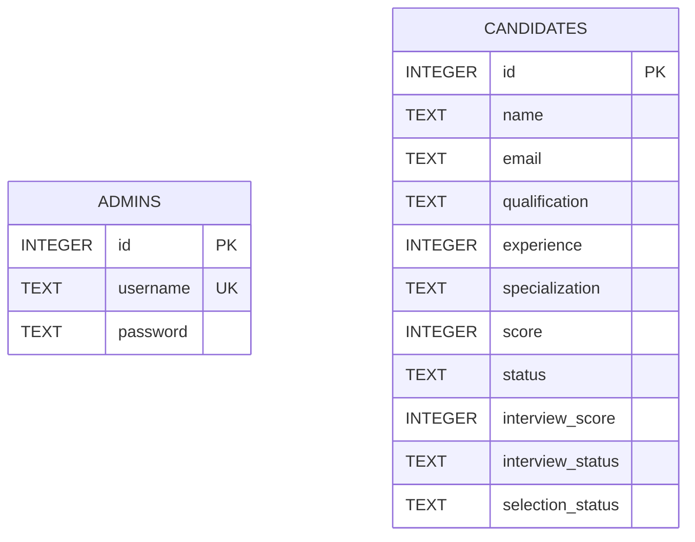

# SmartHireAI ER Diagram

This diagram matches the current SQLite schema in `database.py`.

`admins` and `candidates` are separate tables in the current application. There is no foreign-key relationship between them; the administrator manages candidate records through the Flask dashboard.
